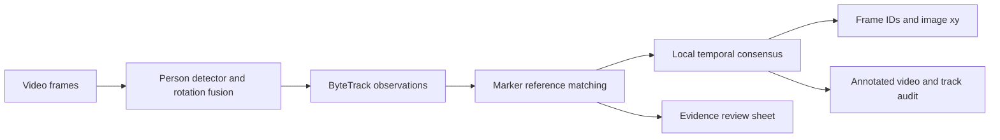

# FootfallCam AI evaluation — solution note

## Objective and observable evidence

Identify frames containing a staff member wearing the illustrated name tag, and report that person's xy location. The tag is a light card with a three-bar dark pattern. The implementation uses this appearance as the identity cue; walking direction, clothing color, and corridor membership are insufficient by themselves. It assumes the supplied tag design stays consistent and the video has a fixed frame rate.

## Method

1. **Detect people and associate observations.** A local YOLO model detects people in the source image and an optional 180-degree view. Boxes are mapped back to the original image, duplicate boxes are suppressed, and one ByteTrack instance associates them. Low-confidence detections are retained for track recovery, while starting new tracks needs stronger evidence.
2. **Inspect the actual tag pattern.** For each sampled person crop, rotation/scale template matching searches for the company-provided marker references. The original upright-torso assumption is removed. A contrast check rejects flat patches; the exported score is correlation, not a probability.
3. **Require local temporal agreement.** A segment needs two strong and three supporting marker samples within a short window, with consistent relative marker location. Track discontinuities and exposure failures split the evidence. Confirmation propagates over nearby observations for a bounded duration, allowing temporarily hidden badges without labelling an unlimited trajectory from a few hits.
4. **Export and visualize.** The pipeline produces staff frame IDs, inclusive frame ranges, pixel coordinates, an annotated MP4, and evidence review sheets. It stores only scalar observations and boxes, then rereads the source for rendering. Optional normalized ROI filtering affects exported locations, not staff classification.



## Output interpretation

Frames are numbered from zero. Time is frame index divided by native FPS. xy is the center of an observed person bounding box in source pixels, with the origin at the top-left. This is an explicit convention for the bonus task, not calibrated floor coordinates. The pipeline does not invent positions on missed detections. It can use future evidence because it processes an offline clip. An unconfirmed person is labelled unknown, not automatically non-staff.

## Evaluation and limitations

The previous solution reported 915 positive frames but did not have ground-truth accuracy measurements. One track received 856 staff labels from only six generic-white-patch hits. This motivates changing the identity evidence and temporal rule before increasing model size further.

The final revision remains unvalidated: automated execution was stopped at the user's request, and the added pytest suite has not been run. Evaluate frame precision/recall/F1 and matched xy errors together with missed and false locations using independently annotated frames. Use separate videos/traversals for threshold selection and final testing. The company reference screenshots are development examples, not holdout data.

Small or blurred tags, strong perspective changes, loose person boxes, and tracking ID swaps can still cause errors. Local evidence limits may miss long marker occlusions. Template matching is an explainable baseline for the supplied material; a dedicated marker detector trained on the available video collection and hard negatives is the next step for broader deployment. A smaller person model or fewer rotated views can improve speed, but its overhead-person recall must be checked.

## Reproduce

```powershell
python -m pip install -r requirements-dev.txt
python -m pytest -q
python -m src.pipeline_runner --video data/raw/sample.mp4 --weights yolov8x.pt --out data/output/improved
```

The README includes CPU options, cache reuse, annotation format, and evaluation commands. Model weights must be supplied locally. The runtime needs the included marker assets, not the original PDF.
